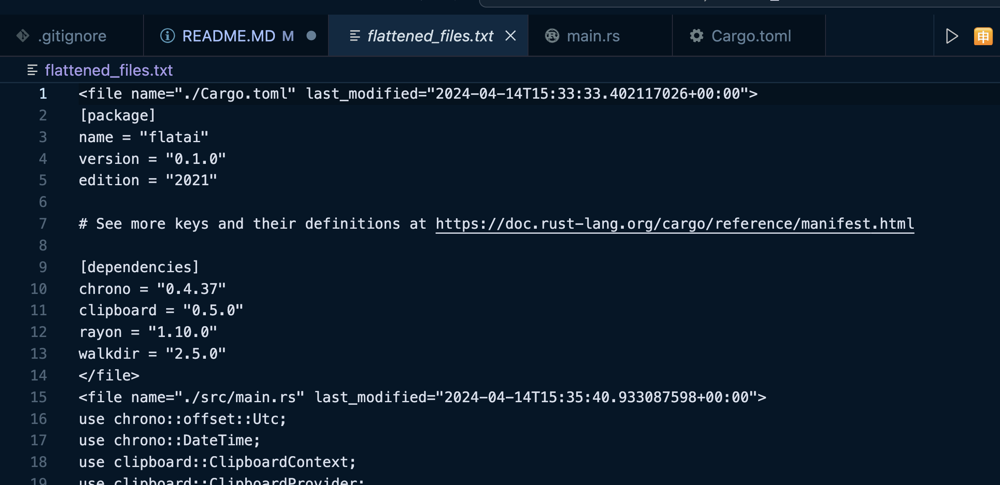

# FLAT.AI - Flatten Files for AI 📁📄

FLAT.AI is a Rust-based tool designed to prepare your codebase for AI analysis. It traverses a given directory, consolidating all `.rs`, `.py`, `.js` and `Cargo.toml` files into a single XML-formatted text file. This makes it easier for AI tools to parse and analyze your code, as they can process one large file instead of many smaller ones.


## Table of Contents 📑

- [Installation](#installation)
- [Usage](#usage)
- [Upcoming Features](#upcoming-features)
- [Contributing](#contributing)
- [License](#license)
- [Contact](#contact)

## Installation ⚙️

To install FLAT.AI, clone the repository and run `cargo build --release` to compile the Rust code. This will create a binary named `flatai`.


### Use Executable 
To use the included executable, simply download the binary file from the repository and move it to your desired directory.

1. Download the `flatai` binary from the repository.
2. Open your terminal and navigate to the directory where the binary is located.
3. Use the `mv` command to move the binary to your desired directory. For example:
    ```sh
    mv flatai /desired/directory/
    ```
    Replace `/desired/directory/` with the actual path to your desired directory.


To add the `flatai` binary to your path, add the following line to your `~/.bashrc` or `~/.zshrc` file:

```sh
export PATH="$PATH:/path/to/your/project/target/release"
```

Replace /path/to/your/project with the actual path to your project. After adding this line, run source ~/.bashrc or source ~/.zshrc to apply the changes.

Now, you can run the flatai command from any directory in your terminal.


```sh
flatai . 
```

```sh
flatai target/dir
```


## Output File 📄
After running FLAT.AI, a file named `flatten_files.txt` will be created in the current directory. This file contains the consolidated code from all the `.rs`, `.py`, `.js`, and `Cargo.toml` files in the directory.

Here is an example screenshot of the `flatten_files.txt` file:


You can use this file for AI analysis and RAG (retrieval augmented generation).

## Contact 📞

You can reach out to me on Twitter at [@fanli_x](https://twitter.com/fanli_x).

